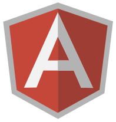

<h1>
  AngularProjects
  
</h1>
Projects developed using Angular.js based on Alura's courses.

 
 
 

<h3> What is Angular ? </h3>
- It is a front-end framework created to develop single page applications "SPAs".

<h3> How is your structure ? </h3>
- Sua estrutura é baseada em componentes, com capacidade para criar aplicativos web escaláveis, além de fornecer uma coleção de bibliotecas integradas.
